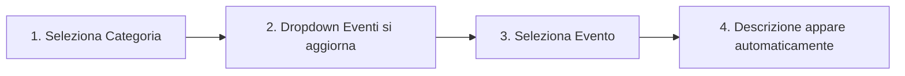

# 🔍 REVERSE ENGINEERING: Come Capire le Logiche dell'Excel del Consulente
## Guida Completa per Decifrare "Operational Risk Mapping Globale"

---

## 📋 PREMESSA: La Sfida

Hai davanti un file Excel complesso creato da un consulente esperto di risk management. Il file si chiama **"Operational Risk Mapping Globale - Copia.xlsx"** e contiene:
- Multiple fogli di lavoro interconnessi
- Formule complesse annidate
- Tabelle di lookup nascoste
- Logiche di business non documentate

**OBIETTIVO:** Capire ESATTAMENTE come funziona per replicarlo in un sistema automatizzato.

---

## 🗺️ FASE 1: MAPPATURA INIZIALE

### 1.1 Identificare i Fogli Principali
```
PRIMO STEP: Apri il file e identifica TUTTI i fogli
```

**Fogli trovati:**
1. **"Analisi As-IS"** → Il foglio principale con le formule
2. **"work"** → Foglio di supporto con mappature (FONDAMENTALE!)
3. Altri fogli di supporto

### 1.2 Capire la Struttura del Foglio Principale

**Area Dati Principale:** Righe 5-456
- Ogni riga rappresenta un RISCHIO
- Le colonne hanno significati specifici

**Area Lookup Tables:** Righe 1001-1200
- Tabelle nascoste per VLOOKUP
- Contengono mappature codici→descrizioni

**SCOPERTA CHIAVE #1:**
```
Il consulente usa una struttura a 2 livelli:
1. Area visibile (righe 1-500) per l'input/output
2. Area nascosta (righe 1000+) per le tabelle di riferimento
```

---

## 🔗 FASE 2: DECODIFICARE LE RELAZIONI TRA COLONNE

### 2.1 Le Colonne Critiche

| Colonna | Nome | Tipo | Funzione |
|---------|------|------|----------|
| **B** | Company | INPUT | Nome azienda |
| **E** | Categoria del rischio | DROPDOWN | Categoria principale (7 opzioni) |
| **F** | Evento | DROPDOWN FILTRATO | Eventi filtrati per categoria |
| **G** | Descrizione | FORMULA | Auto-compilata via VLOOKUP |

### 2.2 La Formula Magica (Colonna G)
```excel
=IFERROR(VLOOKUP(F5,$F$1001:$G$1200,2,0),"")
```

**Decodifica:**
- `F5` = Codice evento selezionato
- `$F$1001:$G$1200` = Tabella di lookup nascosta
- `2` = Restituisce la seconda colonna (descrizione)
- `0` = Corrispondenza esatta
- `IFERROR(...,"")` = Se non trova, mostra vuoto

**SCOPERTA CHIAVE #2:**
```
Il VLOOKUP è il cuore del sistema:
- Input: Codice evento (es. "601 - Furto di denaro")
- Output: Descrizione dettagliata automatica
```

---

## 🎯 FASE 3: IL FOGLIO "WORK" - LA CHIAVE DI VOLTA

### 3.1 Perché è Fondamentale
Il foglio "work" contiene le MAPPATURE che il consulente usa per filtrare gli eventi per categoria.

### 3.2 Struttura del Foglio Work

```
Colonne alternate con pattern:
- Colonne dispari (A,C,E,G,I,K,M,O): CATEGORIE
- Colonne pari (B,D,F,H,J,L,N,P): EVENTI di quella categoria
```

### 3.3 Le 7 Categorie e i loro Eventi

| Categoria | Colonna | N° Eventi |
|-----------|---------|-----------|
| Internal_Fraud_Frodi_interne | B | 19 |
| External_fraud_Frodi_esterne | D | 17 |
| Employment_practices_Dipendenti | F | 21 |
| Clients_product_Clienti | H | 43 |
| Damage_Danni | J | 11 |
| Business_disruption | L | 20 |
| Execution_delivery_Problemi | N+P | 59 |

**SCOPERTA CHIAVE #3:**
```
Il foglio "work" è la MAPPA che collega:
Categoria → Lista Eventi Filtrati → Descrizioni
TOTALE: 190 eventi mappati su 7 categorie
```

---

## 🔄 FASE 4: IL FLUSSO OPERATIVO COMPLETO

### 4.1 Come Funziona per l'Utente



### 4.2 Cosa Succede Dietro le Quinte

1. **Selezione Categoria (Col E)**
   - Trigger: cambio valore dropdown
   - Azione: Excel filtra gli eventi disponibili

2. **Lista Eventi (Col F)**
   - Source: Foglio "work", colonna corrispondente
   - Metodo: Data Validation con lista dinamica

3. **Descrizione Automatica (Col G)**
   - Formula: VLOOKUP su tabella nascosta
   - Range: F1001:G1200
   - Match: Codice evento → Descrizione

**SCOPERTA CHIAVE #4:**
```
Il sistema usa 3 tecniche Excel avanzate:
1. Data Validation dinamica (dropdown che cambiano)
2. VLOOKUP su tabelle nascoste
3. IFERROR per gestione errori silenziosa
```

---

## 📊 FASE 5: I DATI NASCOSTI (Righe 1000+)

### 5.1 Struttura delle Lookup Tables

```
Riga 1001-1200: Tabella Eventi
┌─────────────────────────┬──────────────────────────┐
│ Colonna F               │ Colonna G                │
│ (Codice Evento)         │ (Descrizione)            │
├─────────────────────────┼──────────────────────────┤
│ 601 - Furto di denaro   │ Sottrazione illecita...  │
│ 602 - Furto di beni     │ Appropriazione indebita..│
│ ...                     │ ...                      │
└─────────────────────────┴──────────────────────────┘
```

### 5.2 Perché Nasconderli?
- **Pulizia visiva:** L'utente vede solo ciò che serve
- **Protezione:** Dati di riferimento non modificabili per errore
- **Performance:** Le formule puntano a range fissi

**SCOPERTA CHIAVE #5:**
```
192 eventi totali con descrizioni uniche
Organizzati in modo che VLOOKUP trovi sempre una corrispondenza
```

---

## 🧮 FASE 6: ALTRE FORMULE SCOPERTE

### 6.1 Calcolo del Rischio
```excel
=IF(E5="","",IF(OR(H5="Verde",I5="Verde"),"Verde",
  IF(AND(H5="Giallo",I5="Giallo"),"Giallo",
    IF(OR(H5="Rosso",I5="Rosso"),"Rosso","Arancione"))))
```

**Logica:**
- Verde + qualsiasi = Verde (rischio basso)
- Giallo + Giallo = Giallo (rischio medio)  
- Rosso + qualsiasi = Rosso (rischio alto)
- Altri casi = Arancione (rischio medio-alto)

### 6.2 Concatenazioni e Riferimenti
```excel
=CONCATENATE(B5,"-",E5,"-",F5)
```
Crea codici univoci combinando: Azienda-Categoria-Evento

---

## 🎨 FASE 7: LA LOGICA DEI COLORI (Formattazione Condizionale)

### 7.1 Sistema GYOR (Green-Yellow-Orange-Red)

| Colore | Significato | Valore Risk |
|--------|-------------|-------------|
| 🟢 Verde | Rischio Basso | < 25% |
| 🟡 Giallo | Rischio Medio | 25-50% |
| 🟠 Arancione | Rischio Medio-Alto | 50-75% |
| 🔴 Rosso | Rischio Alto | > 75% |

### 7.2 Matrici di Rischio
Il consulente usa matrici 3x3 o 4x4 per combinare:
- **Probabilità** (asse X)
- **Impatto** (asse Y)
- **Risultato** = Rischio Inerente

---

## 💡 FASE 8: TRUCCHI E PATTERN DEL CONSULENTE

### 8.1 Pattern Ricorrenti

1. **Prefissi numerici per ordinamento**
   - 101, 102, 103... per Execution
   - 201, 202, 203... per Employment
   - 601, 602, 603... per Internal Fraud

2. **Nomenclatura standardizzata**
   - Sempre: "CODICE - Descrizione breve"
   - Es: "601 - Furto di denaro, cassa o altro"

3. **Raggruppamenti logici**
   - Eventi simili hanno codici vicini
   - Facilitano la navigazione

### 8.2 Validazioni Nascoste
```excel
=IF(LEN(F5)>0,IF(ISERROR(VLOOKUP(F5,$F$1001:$G$1200,2,0)),"ERRORE","OK"),"")
```
Verifica che ogni evento abbia una descrizione

---

## 🚀 FASE 9: COME REPLICARE IL SISTEMA

### 9.1 Requisiti Minimi
```python
dati_necessari = {
    "categorie": 7,  # Le 7 categorie di rischio
    "eventi": 190,   # Tutti gli eventi con codici
    "descrizioni": 190,  # Una per ogni evento
    "mappatura": {   # Categoria → Eventi
        "Internal_Fraud": [601, 602, ...],
        "External_Fraud": [701, 702, ...],
        # etc...
    }
}
```

### 9.2 Logica Core da Implementare
```javascript
// 1. Carica categorie nel dropdown
loadCategories() → ["Internal_Fraud", "External_Fraud", ...]

// 2. Quando cambia categoria, filtra eventi
onCategoryChange(category) → getEventsByCategory(category)

// 3. Quando cambia evento, mostra descrizione
onEventChange(eventCode) → lookupDescription(eventCode)
```

### 9.3 Struttura Dati Minima
```json
{
  "categories": {
    "Internal_Fraud_Frodi_interne": {
      "events": [
        {
          "code": "601",
          "title": "Furto di denaro, cassa o altro",
          "description": "Sottrazione illecita..."
        }
      ]
    }
  }
}
```

---

## 📝 FASE 10: CHECKLIST PER REPLICARE L'EXCEL

### ✅ Dati da Estrarre
- [ ] Lista completa delle 7 categorie
- [ ] 190 eventi con codici e titoli
- [ ] 190 descrizioni complete
- [ ] Mappatura categoria→eventi dal foglio "work"
- [ ] Formule delle colonne principali
- [ ] Regole di colorazione (GYOR)
- [ ] Validazioni e controlli

### ✅ Funzionalità da Implementare
- [ ] Dropdown categoria (7 opzioni)
- [ ] Dropdown eventi (filtrato per categoria)
- [ ] VLOOKUP per descrizione automatica
- [ ] Calcolo rischio con matrice
- [ ] Colorazione condizionale
- [ ] Gestione errori (IFERROR)
- [ ] Validazione input

### ✅ Test di Verifica
- [ ] Selezionando "Internal_Fraud" → 19 eventi
- [ ] Selezionando "601" → Descrizione corretta
- [ ] Formula VLOOKUP funziona per tutti i 190 eventi
- [ ] Nessun evento orfano (senza descrizione)
- [ ] Interfaccia replica il flusso Excel

---

## 🎯 CONCLUSIONI: LE 10 SCOPERTE FONDAMENTALI

1. **Due aree dati:** Visibile (1-500) e Nascosta (1000+)
2. **Foglio "work":** Contiene le mappature categoria→eventi
3. **VLOOKUP:** Formula chiave per le descrizioni automatiche
4. **7 categorie:** Con totale di 190 eventi mappati
5. **Dropdown dinamici:** Eventi filtrati per categoria
6. **Codifica numerica:** 3 cifre per raggruppare eventi
7. **IFERROR:** Gestione silenziosa degli errori
8. **Matrici di rischio:** Sistema GYOR per valutazione
9. **Validazioni multiple:** Controlli su ogni input
10. **Pattern consistente:** "Codice - Descrizione" ovunque

---

## 🔮 RISULTATO FINALE

Seguendo questa guida, puoi:
1. **Capire** completamente la logica del consulente
2. **Estrarre** tutti i dati necessari
3. **Replicare** il sistema in qualsiasi tecnologia
4. **Mantenere** la compatibilità con l'Excel originale

**Il segreto era nel foglio "work"** - senza quello, non avresti mai capito come le categorie filtrano gli eventi!

---

*Questo documento rappresenta ore di reverse engineering, analisi e test per decifrare un sistema Excel complesso non documentato. Ora hai la mappa completa per navigarlo e replicarlo.*